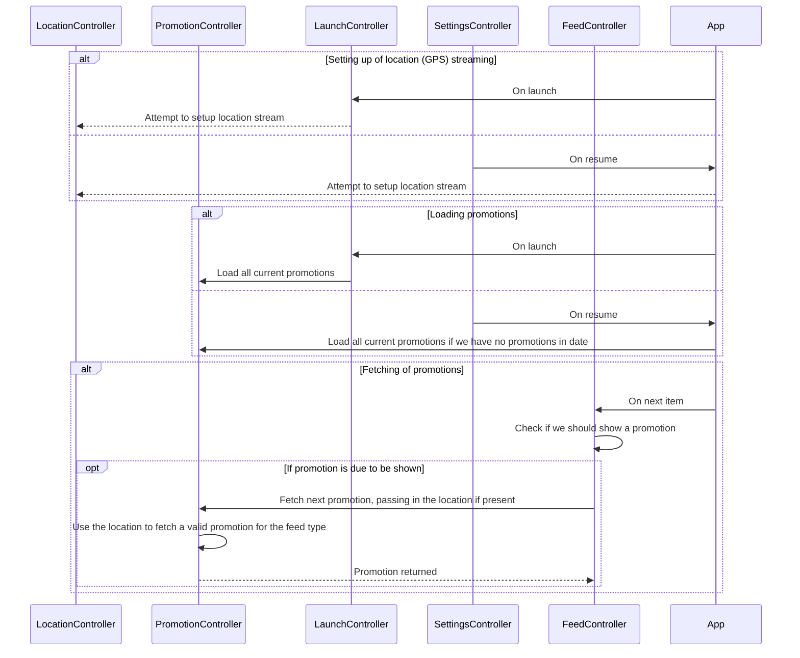

```mermaid
sequenceDiagram
    participant LocationController
    participant PromotionController
    participant LaunchController
    participant SettingsController
    participant FeedController
    participant App

    alt Setting up of location (GPS) streaming
    App->>LaunchController: On launch
    LaunchController-->>LocationController: Attempt to setup location stream
    else
    SettingsController->>App: On resume
    App-->>LocationController: Attempt to setup location stream
    end

    alt Loading promotions
    App->>LaunchController: On launch
    LaunchController->>PromotionController: Load all current promotions
    else
    SettingsController->>App: On resume
    App->>PromotionController: Load all current promotions if we have no promotions in date
    end

    alt Fetching of promotions
    App->>FeedController: On next item
    FeedController->>FeedController: Check if we should show a promotion
        opt If promotion is due to be shown
        FeedController->>PromotionController: Fetch next promotion, passing in the location if present
        PromotionController->>PromotionController: Use the location to fetch a valid promotion for the feed type
        PromotionController-->>FeedController: Promotion returned
        end
    end
```